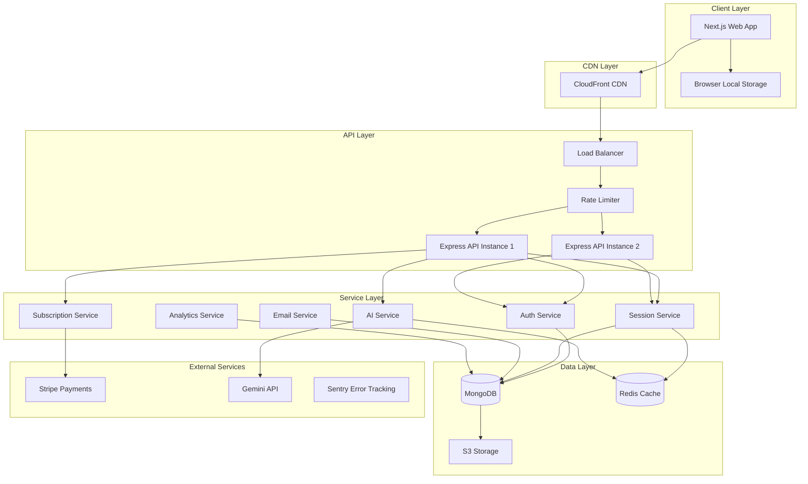

# Design Document: Production-Ready Focusaint

## Overview

This design document outlines the architecture and implementation approach for transforming focusaint into a production-ready habit tracking and study management platform. The system builds upon existing authentication, habit tracking, and task management features to add comprehensive free tier features, premium tier capabilities, competitive moat features, and production-grade infrastructure.

The design follows a monorepo architecture with a Next.js 16 frontend, Express.js 5 backend, and MongoDB database. Key design principles include:

- **Tier-based feature gating**: Clear separation between free and premium capabilities
- **Scalable architecture**: Support for growing user base and feature set
- **Security-first approach**: Comprehensive security measures at all layers
- **Performance optimization**: Fast, responsive user experience
- **Observability**: Comprehensive monitoring and logging
- **Data integrity**: Reliable backup and recovery systems

## Architecture

### High-Level Architecture



### Technology Stack

**Frontend:**
- Next.js 16 with App Router
- React 19.2 with TypeScript 5
- Tailwind CSS 4 for styling
- shadcn/ui component library
- Framer Motion for animations
- Recharts for data visualization

**Backend:**
- Express.js 5 with TypeScript
- Node.js with ES modules
- JWT for authentication
- bcryptjs for password hashing

**Database & Caching:**
- MongoDB 7.0 with Mongoose 9
- Redis for caching and rate limiting
- S3-compatible storage for backups

**External Services:**
- Stripe for payment processing
- Gemini API for AI features
- Nodemailer for email delivery
- Sentry for error tracking

**Infrastructure:**
- Docker & Docker Compose for containerization
- GitHub Actions for CI/CD
- Vercel for frontend hosting (recommended)
- Railway/Render for backend hosting

### Security Architecture

**Defense in Depth Strategy:**

1. **Network Layer**: Rate limiting, DDoS protection, IP whitelisting for admin endpoints
2. **Application Layer**: Input validation, output encoding, CSRF protection, secure headers
3. **Data Layer**: Encryption at rest, encrypted backups, parameterized queries
4. **Authentication Layer**: JWT with short expiration, refresh tokens, secure password hashing
5. **Authorization Layer**: Role-based access control, tier-based feature gating

## Components and Interfaces

### Frontend Components

#### 1. Tier Management System

**Purpose**: Enforce feature access based on user subscription tier

**Interface:**
```typescript
interface TierManager {
  checkFeatureAccess(feature: FeatureName): boolean;
  getRemainingQuota(resource: ResourceType): number;
  showUpgradePrompt(feature: FeatureName): void;
}

enum FeatureName {
  QUICK_MODE = 'quick_mode',
  DEEP_MODE = 'deep_mode',
  CLOUD_SYNC = 'cloud_sync',
  UNLIMITED_HISTORY = 'unlimited_history',
  ADVANCED_ANALYTICS = 'advanced_analytics',
  EXPORT_DATA = 'export_data',
  STREAK_INSURANCE = 'streak_insurance',
  CUSTOM_AI_PERSONA = 'custom_ai_persona',
  PRIVATE_GROUPS = 'private_groups'
}

enum ResourceType {
  DAILY_SESSIONS = 'daily_sessions',
  LLM_TOKENS = 'llm_tokens',
  STREAK_FREEZES = 'streak_freezes'
}
```

**Implementation Notes:**
- Check user tier on component mount and before feature access
- Cache tier information in React context to avoid repeated API calls
- Display upgrade prompts using modal components from shadcn/ui
- Track upgrade prompt impressions for analytics

#### 2. Session Manager

**Purpose**: Handle session creation, tracking, and limits

**Interface:**
```typescript
interface SessionManager {
  startSession(type: SessionType): Promise<Session>;
  endSession(sessionId: string): Promise<SessionResult>;
  pauseSession(sessionId: string): Promise<void>;
  resumeSession(sessionId: string): Promise<void>;
  getActiveSession(): Promise<Session | null>;
  getDailySessionCount(): Promise<number>;
}

interface Session {
  id: string;
  userId: string;
  type: SessionType;
  startTime: Date;
  endTime?: Date;
  pausedDuration: number;
  status: 'active' | 'paused' | 'completed';
}

enum SessionType {
  QUICK = 'quick',
  DEEP = 'deep',
  QUIZ = 'quiz',
  RECALL = 'recall'
}
```


#### 3. Storage Adapter

**Purpose**: Abstract storage layer to support both local and cloud storage

**Interface:**
```typescript
interface StorageAdapter {
  save(key: string, data: any): Promise<void>;
  load(key: string): Promise<any>;
  delete(key: string): Promise<void>;
  list(prefix: string): Promise<string[]>;
  sync(): Promise<void>;
}

class LocalStorageAdapter implements StorageAdapter {
  // Browser localStorage implementation
}

class CloudStorageAdapter implements StorageAdapter {
  // API-backed cloud storage implementation
}

class StorageFactory {
  static create(userTier: UserTier): StorageAdapter {
    return userTier === 'premium' 
      ? new CloudStorageAdapter() 
      : new LocalStorageAdapter();
  }
}
```

#### 4. AI Study Coach Component

**Purpose**: Provide personalized AI assistance with token management

**Interface:**
```typescript
interface StudyCoach {
  sendMessage(message: string): Promise<CoachResponse>;
  getConversationHistory(): Promise<Message[]>;
  getRemainingTokens(): Promise<number>;
  setPersona(persona: AIPersona): Promise<void>;
}

interface CoachResponse {
  message: string;
  tokensUsed: number;
  suggestions?: string[];
  interventions?: Intervention[];
}

interface AIPersona {
  tone: 'friendly' | 'professional' | 'motivational' | 'strict';
  style: 'concise' | 'detailed' | 'socratic';
  customInstructions?: string;
}
```

#### 5. Gamification Engine

**Purpose**: Track achievements, milestones, and rewards

**Interface:**
```typescript
interface GamificationEngine {
  checkMilestones(userId: string): Promise<Achievement[]>;
  awardBadge(userId: string, badgeId: string): Promise<void>;
  getProgress(milestoneId: string): Promise<MilestoneProgress>;
  generateShareableImage(achievementId: string): Promise<string>;
}

interface Achievement {
  id: string;
  name: string;
  description: string;
  tier: 'bronze' | 'silver' | 'gold' | 'platinum';
  icon: string;
  earnedAt: Date;
}

interface MilestoneProgress {
  current: number;
  target: number;
  percentage: number;
}
```

### Backend Services

#### 1. Rate Limiting Service

**Purpose**: Protect API endpoints from abuse

**Implementation:**
```typescript
interface RateLimiter {
  checkLimit(identifier: string, endpoint: string): Promise<RateLimitResult>;
  incrementCounter(identifier: string, endpoint: string): Promise<void>;
  resetCounter(identifier: string, endpoint: string): Promise<void>;
}

interface RateLimitResult {
  allowed: boolean;
  remaining: number;
  resetAt: Date;
}

// Rate limit configurations
const RATE_LIMITS = {
  '/api/auth/login': { requests: 5, window: 900 }, // 5 per 15 min
  '/api/auth/signup': { requests: 3, window: 3600 }, // 3 per hour
  '/api/ai/chat': { requests: 20, window: 3600 }, // 20 per hour
  '/api/*': { requests: 100, window: 60 } // 100 per minute default
};
```

#### 2. Subscription Service

**Purpose**: Manage user subscriptions and tier changes

**Interface:**
```typescript
interface SubscriptionService {
  createSubscription(userId: string, plan: PlanType): Promise<Subscription>;
  cancelSubscription(subscriptionId: string): Promise<void>;
  upgradeSubscription(subscriptionId: string, newPlan: PlanType): Promise<void>;
  handleWebhook(event: StripeEvent): Promise<void>;
  checkSubscriptionStatus(userId: string): Promise<SubscriptionStatus>;
}

interface Subscription {
  id: string;
  userId: string;
  plan: PlanType;
  status: 'active' | 'canceled' | 'past_due' | 'expired';
  currentPeriodStart: Date;
  currentPeriodEnd: Date;
  cancelAtPeriodEnd: boolean;
}

enum PlanType {
  FREE = 'free',
  PREMIUM_MONTHLY = 'premium_monthly',
  PREMIUM_YEARLY = 'premium_yearly'
}
```

#### 3. Focus Score Calculator

**Purpose**: Calculate user productivity metrics

**Interface:**
```typescript
interface FocusScoreCalculator {
  calculateScore(userId: string): Promise<FocusScore>;
  getScoreBreakdown(userId: string): Promise<ScoreBreakdown>;
  updateScore(userId: string): Promise<void>;
}

interface FocusScore {
  total: number;
  rank: number;
  percentile: number;
  trend: 'up' | 'down' | 'stable';
}

interface ScoreBreakdown {
  sessionTime: number; // 40% weight
  consistency: number; // 30% weight
  engagement: number; // 20% weight
  performance: number; // 10% weight
}

// Calculation formula
function calculateFocusScore(breakdown: ScoreBreakdown): number {
  return (
    breakdown.sessionTime * 0.4 +
    breakdown.consistency * 0.3 +
    breakdown.engagement * 0.2 +
    breakdown.performance * 0.1
  );
}
```


#### 4. Adaptive Revision Engine

**Purpose**: Implement spaced repetition with AI personalization

**Interface:**
```typescript
interface RevisionEngine {
  scheduleReview(topicId: string, userId: string): Promise<ReviewSchedule>;
  recordReviewResult(reviewId: string, performance: number): Promise<void>;
  getNextReviews(userId: string): Promise<ReviewSchedule[]>;
  adjustInterval(reviewId: string, performance: number): Promise<void>;
}

interface ReviewSchedule {
  id: string;
  topicId: string;
  userId: string;
  scheduledFor: Date;
  interval: number; // days
  easeFactor: number; // SM-2 algorithm
  repetitions: number;
}

// SM-2 Algorithm with AI adjustments
function calculateNextInterval(
  currentInterval: number,
  easeFactor: number,
  performance: number, // 0-5 scale
  userHistory: PerformanceHistory
): number {
  // Base SM-2 calculation
  let newEaseFactor = easeFactor + (0.1 - (5 - performance) * (0.08 + (5 - performance) * 0.02));
  newEaseFactor = Math.max(1.3, newEaseFactor);
  
  // AI personalization based on user history
  const personalizedMultiplier = calculatePersonalizedMultiplier(userHistory);
  
  let newInterval: number;
  if (performance < 3) {
    newInterval = 1; // Reset for poor performance
  } else {
    newInterval = currentInterval * newEaseFactor * personalizedMultiplier;
  }
  
  return Math.round(newInterval);
}
```

#### 5. Shallow Learning Detector

**Purpose**: Identify ineffective study patterns and intervene

**Interface:**
```typescript
interface ShallowLearningDetector {
  analyzePatterns(userId: string): Promise<DetectionResult>;
  generateInterventions(patterns: StudyPattern[]): Promise<Intervention[]>;
  trackInterventionEffectiveness(interventionId: string): Promise<void>;
}

interface DetectionResult {
  isShallowLearning: boolean;
  confidence: number;
  indicators: Indicator[];
  recommendations: string[];
}

interface Indicator {
  type: 'declining_retention' | 'short_sessions' | 'low_engagement' | 'poor_review_spacing';
  severity: 'low' | 'medium' | 'high';
  evidence: any;
}

interface Intervention {
  id: string;
  type: 'notification' | 'email' | 'coach_message';
  message: string;
  actionableSteps: string[];
  scheduledFor: Date;
}

// Detection algorithm
function detectShallowLearning(
  sessionData: Session[],
  quizResults: QuizResult[],
  reviewData: ReviewSchedule[]
): DetectionResult {
  const indicators: Indicator[] = [];
  
  // Check for declining quiz performance despite regular sessions
  const recentQuizTrend = calculateQuizTrend(quizResults, 14);
  if (recentQuizTrend < -0.1 && sessionData.length > 10) {
    indicators.push({
      type: 'declining_retention',
      severity: 'high',
      evidence: { trend: recentQuizTrend }
    });
  }
  
  // Check for consistently short sessions
  const avgSessionDuration = calculateAvgDuration(sessionData);
  if (avgSessionDuration < 15) { // minutes
    indicators.push({
      type: 'short_sessions',
      severity: 'medium',
      evidence: { avgDuration: avgSessionDuration }
    });
  }
  
  // Check for poor review spacing
  const reviewSpacing = analyzeReviewSpacing(reviewData);
  if (reviewSpacing.cramming > 0.5) {
    indicators.push({
      type: 'poor_review_spacing',
      severity: 'high',
      evidence: reviewSpacing
    });
  }
  
  return {
    isShallowLearning: indicators.length >= 2,
    confidence: calculateConfidence(indicators),
    indicators,
    recommendations: generateRecommendations(indicators)
  };
}
```

#### 6. Weekly Report Generator

**Purpose**: Create and send automated performance reports

**Interface:**
```typescript
interface ReportGenerator {
  generateWeeklyReport(userId: string): Promise<WeeklyReport>;
  sendReport(report: WeeklyReport): Promise<void>;
  scheduleReports(): Promise<void>;
}

interface WeeklyReport {
  userId: string;
  weekStart: Date;
  weekEnd: Date;
  totalStudyTime: number;
  focusScoreChange: number;
  streakStatus: StreakInfo;
  topAchievements: Achievement[];
  recommendations: string[];
  charts: ChartData[];
}

interface ChartData {
  type: 'bar' | 'line' | 'pie';
  title: string;
  data: any[];
}
```

## Data Models

### User Model (Extended)

```typescript
interface User {
  _id: ObjectId;
  email: string;
  password: string; // bcrypt hashed
  isEmailVerified: boolean;
  
  // Profile
  name: string;
  avatar?: string;
  bio?: string;
  
  // Subscription
  tier: 'free' | 'premium';
  subscriptionId?: string;
  subscriptionStatus?: string;
  subscriptionEndDate?: Date;
  
  // Quotas
  dailySessionCount: number;
  dailyLLMTokens: number;
  lastSessionReset: Date;
  lastTokenReset: Date;
  
  // Preferences
  storagePreference: 'local' | 'cloud';
  notificationsEnabled: boolean;
  emailReportsEnabled: boolean;
  aiPersona?: AIPersona;
  
  // Privacy
  profileVisibility: 'public' | 'friends' | 'private';
  leaderboardOptIn: boolean;
  
  // Gamification
  focusScore: number;
  badges: string[];
  streakFreezes: number;
  lastStreakFreeze?: Date;
  
  // Timestamps
  createdAt: Date;
  updatedAt: Date;
  lastActive: Date;
}
```

### Session Model (Extended)

```typescript
interface HabitSession {
  _id: ObjectId;
  userId: ObjectId;
  type: 'quick' | 'deep' | 'quiz' | 'recall';
  
  // Timing
  startTime: Date;
  endTime?: Date;
  pausedDuration: number;
  totalDuration: number;
  
  // Status
  status: 'active' | 'paused' | 'completed' | 'abandoned';
  
  // Content
  topic?: string;
  notes?: string;
  attachments?: string[];
  
  // Analytics
  focusScoreContribution: number;
  engagementMetrics: {
    interactions: number;
    notesCreated: number;
    quizzesTaken: number;
  };
  
  // Device tracking (for premium multi-device)
  deviceId?: string;
  deviceType?: string;
  
  createdAt: Date;
  updatedAt: Date;
}
```


### Subscription Model

```typescript
interface Subscription {
  _id: ObjectId;
  userId: ObjectId;
  
  // Stripe integration
  stripeCustomerId: string;
  stripeSubscriptionId: string;
  stripePriceId: string;
  
  // Plan details
  plan: 'premium_monthly' | 'premium_yearly';
  status: 'active' | 'canceled' | 'past_due' | 'expired' | 'trialing';
  
  // Billing
  currentPeriodStart: Date;
  currentPeriodEnd: Date;
  cancelAtPeriodEnd: boolean;
  canceledAt?: Date;
  
  // Trial
  trialStart?: Date;
  trialEnd?: Date;
  
  // Payment history
  lastPaymentDate?: Date;
  lastPaymentAmount?: number;
  failedPaymentAttempts: number;
  
  createdAt: Date;
  updatedAt: Date;
}
```

### Achievement Model

```typescript
interface Achievement {
  _id: ObjectId;
  userId: ObjectId;
  
  // Achievement details
  badgeId: string;
  name: string;
  description: string;
  tier: 'bronze' | 'silver' | 'gold' | 'platinum';
  icon: string;
  
  // Progress
  progress: number;
  target: number;
  completed: boolean;
  
  // Metadata
  earnedAt?: Date;
  sharedAt?: Date;
  shareCount: number;
  
  createdAt: Date;
  updatedAt: Date;
}
```

### Review Schedule Model

```typescript
interface ReviewSchedule {
  _id: ObjectId;
  userId: ObjectId;
  topicId: ObjectId;
  
  // SM-2 algorithm data
  easeFactor: number;
  interval: number; // days
  repetitions: number;
  
  // Scheduling
  lastReviewDate?: Date;
  nextReviewDate: Date;
  
  // Performance tracking
  performanceHistory: {
    date: Date;
    score: number; // 0-5
    duration: number;
  }[];
  
  // AI personalization
  personalizedMultiplier: number;
  
  createdAt: Date;
  updatedAt: Date;
}
```

### Accountability Group Model

```typescript
interface AccountabilityGroup {
  _id: ObjectId;
  name: string;
  description: string;
  
  // Members
  adminId: ObjectId;
  members: ObjectId[];
  maxMembers: number; // 5 for free, unlimited for premium
  
  // Privacy
  visibility: 'public' | 'private';
  joinCode?: string;
  
  // Activity
  lastActivityAt: Date;
  totalSessions: number;
  
  createdAt: Date;
  updatedAt: Date;
}
```

### LLM Token Usage Model

```typescript
interface LLMTokenUsage {
  _id: ObjectId;
  userId: ObjectId;
  
  // Usage tracking
  date: Date;
  tokensUsed: number;
  requestCount: number;
  
  // Context
  feature: 'study_coach' | 'quiz_generation' | 'note_summary' | 'recommendations';
  
  createdAt: Date;
}
```

### Audit Log Model

```typescript
interface AuditLog {
  _id: ObjectId;
  userId?: ObjectId;
  
  // Event details
  action: string;
  resource: string;
  resourceId?: string;
  
  // Context
  ipAddress: string;
  userAgent: string;
  
  // Result
  success: boolean;
  errorMessage?: string;
  
  // Metadata
  metadata: any;
  
  createdAt: Date;
}
```

## Database Indexes

Critical indexes for performance:

```typescript
// User collection
db.users.createIndex({ email: 1 }, { unique: true });
db.users.createIndex({ tier: 1 });
db.users.createIndex({ focusScore: -1 });
db.users.createIndex({ lastActive: -1 });

// HabitSession collection
db.habitsessions.createIndex({ userId: 1, createdAt: -1 });
db.habitsessions.createIndex({ userId: 1, status: 1 });
db.habitsessions.createIndex({ startTime: -1 });

// Subscription collection
db.subscriptions.createIndex({ userId: 1 }, { unique: true });
db.subscriptions.createIndex({ stripeCustomerId: 1 });
db.subscriptions.createIndex({ status: 1, currentPeriodEnd: 1 });

// Achievement collection
db.achievements.createIndex({ userId: 1, badgeId: 1 });
db.achievements.createIndex({ userId: 1, completed: 1 });

// ReviewSchedule collection
db.reviewschedules.createIndex({ userId: 1, nextReviewDate: 1 });
db.reviewschedules.createIndex({ nextReviewDate: 1 });

// LLMTokenUsage collection
db.llmtokenusage.createIndex({ userId: 1, date: -1 });
db.llmtokenusage.createIndex({ date: 1 }, { expireAfterSeconds: 2592000 }); // 30 days TTL

// AuditLog collection
db.auditlogs.createIndex({ userId: 1, createdAt: -1 });
db.auditlogs.createIndex({ createdAt: 1 }, { expireAfterSeconds: 7776000 }); // 90 days TTL
```


## Error Handling

### Error Classification

**Client Errors (4xx):**
- 400 Bad Request: Invalid input, validation failures
- 401 Unauthorized: Missing or invalid JWT token
- 403 Forbidden: Insufficient permissions, tier restrictions
- 404 Not Found: Resource doesn't exist
- 409 Conflict: Duplicate resource, state conflicts
- 429 Too Many Requests: Rate limit exceeded

**Server Errors (5xx):**
- 500 Internal Server Error: Unexpected server errors
- 502 Bad Gateway: External service failures
- 503 Service Unavailable: Maintenance mode, overload
- 504 Gateway Timeout: External service timeouts

### Error Response Format

All API errors follow a consistent format:

```typescript
interface ErrorResponse {
  error: {
    code: string;
    message: string;
    details?: any;
    timestamp: string;
    requestId: string;
  };
}

// Example responses
{
  "error": {
    "code": "SESSION_LIMIT_REACHED",
    "message": "You've reached your daily limit of 3 sessions. Upgrade to premium for unlimited sessions.",
    "details": {
      "currentCount": 3,
      "limit": 3,
      "resetAt": "2024-01-15T00:00:00Z"
    },
    "timestamp": "2024-01-14T15:30:00Z",
    "requestId": "req_abc123"
  }
}

{
  "error": {
    "code": "TOKEN_LIMIT_EXCEEDED",
    "message": "Daily LLM token limit exceeded. Resets at midnight UTC.",
    "details": {
      "used": 1000,
      "limit": 1000,
      "resetAt": "2024-01-15T00:00:00Z"
    },
    "timestamp": "2024-01-14T15:30:00Z",
    "requestId": "req_def456"
  }
}
```

### Error Handling Middleware

```typescript
// Backend error handler
function errorHandler(err: Error, req: Request, res: Response, next: NextFunction) {
  // Log error to Sentry
  Sentry.captureException(err, {
    user: { id: req.user?.id },
    tags: { endpoint: req.path },
    extra: { body: req.body, query: req.query }
  });
  
  // Determine error type
  if (err instanceof ValidationError) {
    return res.status(400).json({
      error: {
        code: 'VALIDATION_ERROR',
        message: err.message,
        details: err.errors,
        timestamp: new Date().toISOString(),
        requestId: req.id
      }
    });
  }
  
  if (err instanceof AuthenticationError) {
    return res.status(401).json({
      error: {
        code: 'AUTHENTICATION_FAILED',
        message: 'Invalid or expired token',
        timestamp: new Date().toISOString(),
        requestId: req.id
      }
    });
  }
  
  if (err instanceof TierRestrictionError) {
    return res.status(403).json({
      error: {
        code: err.code,
        message: err.message,
        details: err.details,
        timestamp: new Date().toISOString(),
        requestId: req.id
      }
    });
  }
  
  // Default to 500 for unknown errors
  res.status(500).json({
    error: {
      code: 'INTERNAL_ERROR',
      message: 'An unexpected error occurred',
      timestamp: new Date().toISOString(),
      requestId: req.id
    }
  });
}
```

### Frontend Error Handling

```typescript
// API client with error handling
class APIClient {
  async request<T>(endpoint: string, options?: RequestInit): Promise<T> {
    try {
      const response = await fetch(`${API_BASE_URL}${endpoint}`, {
        ...options,
        headers: {
          'Content-Type': 'application/json',
          'Authorization': `Bearer ${getToken()}`,
          ...options?.headers
        }
      });
      
      if (!response.ok) {
        const errorData = await response.json();
        throw new APIError(errorData.error);
      }
      
      return await response.json();
    } catch (error) {
      if (error instanceof APIError) {
        // Handle specific error codes
        if (error.code === 'SESSION_LIMIT_REACHED') {
          showUpgradeModal('sessions');
        } else if (error.code === 'TOKEN_LIMIT_EXCEEDED') {
          showUpgradeModal('tokens');
        } else if (error.code === 'AUTHENTICATION_FAILED') {
          redirectToLogin();
        }
        throw error;
      }
      
      // Network or unexpected errors
      Sentry.captureException(error);
      throw new Error('Network error. Please check your connection.');
    }
  }
}
```

### Graceful Degradation

When external services fail, the system should degrade gracefully:

**OpenAI API Failure:**
- Display cached responses if available
- Show "AI temporarily unavailable" message
- Queue requests for retry
- Offer alternative features (manual note-taking)

**Stripe API Failure:**
- Allow existing premium users to continue
- Queue subscription changes for processing
- Display maintenance message for new subscriptions

**Email Service Failure:**
- Queue emails for retry (up to 24 hours)
- Store reports in user dashboard as fallback
- Log failures for manual intervention

**Redis Cache Failure:**
- Fall back to database queries
- Log performance degradation
- Continue operation without caching

## Testing Strategy

### Testing Pyramid

```
        /\
       /E2E\         10% - Critical user flows
      /------\
     /  INT   \      20% - API integration tests
    /----------\
   /   UNIT     \    70% - Component & function tests
  /--------------\
```

### Unit Testing

**Frontend Unit Tests (Vitest + React Testing Library):**
- Component rendering and interactions
- Utility functions and helpers
- Custom hooks
- State management logic
- Form validation

**Backend Unit Tests (Jest):**
- Service layer functions
- Utility functions
- Calculation algorithms (Focus Score, Revision Engine)
- Data transformations
- Validation logic

**Target Coverage:** 80% minimum

### Integration Testing

**API Integration Tests:**
- Authentication flows
- Session management
- Subscription lifecycle
- Data synchronization
- Rate limiting behavior
- Tier-based access control

**Database Integration Tests:**
- Model CRUD operations
- Query performance
- Index effectiveness
- Transaction handling
- Data integrity constraints

### End-to-End Testing (Playwright)

**Critical User Flows:**
1. User signup → email verification → first session
2. Free user → session limit → upgrade prompt → payment → premium access
3. Create session → pause → resume → complete → view analytics
4. AI coach interaction → token usage → limit reached
5. Streak tracking → freeze streak → verify preservation
6. Join accountability group → share progress → receive notifications

### Property-Based Testing

Property-based tests will be used to verify universal correctness properties across the system. Each property test will run a minimum of 100 iterations with randomized inputs.

**Testing Library:** fast-check (TypeScript/JavaScript)

**Property Test Configuration:**
```typescript
import fc from 'fast-check';

// Example property test structure
describe('Feature: production-ready-focusaint, Property X', () => {
  it('should satisfy property X', () => {
    fc.assert(
      fc.property(
        fc.record({
          // Generators for test data
        }),
        (testData) => {
          // Property assertion
        }
      ),
      { numRuns: 100 }
    );
  });
});
```

### Load Testing

**Tools:** k6 or Artillery

**Scenarios:**
- 100 concurrent users creating sessions
- 500 concurrent users viewing dashboard
- 50 concurrent AI chat requests
- Database query performance under load
- Cache hit rates under load

**Performance Targets:**
- API response time: p95 < 500ms
- Page load time: p95 < 2s
- Database queries: p95 < 100ms
- Cache hit rate: > 80%

### Security Testing

**Automated Security Scans:**
- OWASP ZAP for vulnerability scanning
- npm audit for dependency vulnerabilities
- Snyk for continuous security monitoring

**Manual Security Testing:**
- Penetration testing before launch
- Authentication bypass attempts
- Authorization boundary testing
- Input injection testing
- Rate limit bypass attempts

### Accessibility Testing

**Tools:** axe-core, Lighthouse

**Requirements:**
- WCAG 2.1 AA compliance
- Keyboard navigation support
- Screen reader compatibility
- Color contrast ratios
- Focus indicators

**Note:** While we aim for WCAG compliance, full validation requires manual testing with assistive technologies.

### Monitoring and Observability

**Error Tracking (Sentry):**
- Automatic error capture
- User context and breadcrumbs
- Performance monitoring
- Release tracking

**Application Metrics:**
- API response times
- Database query performance
- Cache hit rates
- External service latency
- Error rates by endpoint

**Business Metrics:**
- Daily/Monthly Active Users (DAU/MAU)
- Session completion rates
- Free to premium conversion rate
- Feature usage by tier
- Churn rate
- LLM token consumption

**Alerting Thresholds:**
- Error rate > 1% → Page on-call
- API p95 > 1s → Alert team
- Database connections > 80% → Alert team
- Disk usage > 85% → Alert team
- Failed payments > 5% → Alert finance team

### CI/CD Pipeline

**GitHub Actions Workflow:**

```yaml
name: CI/CD Pipeline

on:
  push:
    branches: [main, develop]
  pull_request:
    branches: [main]

jobs:
  test:
    runs-on: ubuntu-latest
    steps:
      - uses: actions/checkout@v3
      - uses: actions/setup-node@v3
      - run: npm ci
      - run: npm run lint
      - run: npm run test:unit
      - run: npm run test:integration
      
  build:
    needs: test
    runs-on: ubuntu-latest
    steps:
      - uses: actions/checkout@v3
      - run: npm run build
      - run: npm run test:e2e
      
  deploy-staging:
    needs: build
    if: github.ref == 'refs/heads/develop'
    runs-on: ubuntu-latest
    steps:
      - run: npm run deploy:staging
      
  deploy-production:
    needs: build
    if: github.ref == 'refs/heads/main'
    runs-on: ubuntu-latest
    steps:
      - run: npm run deploy:production
      - run: npm run smoke-test:production
```

**Deployment Strategy:**
- Blue-green deployment for zero downtime
- Automatic rollback on health check failure
- Database migrations run before deployment
- Smoke tests after deployment

